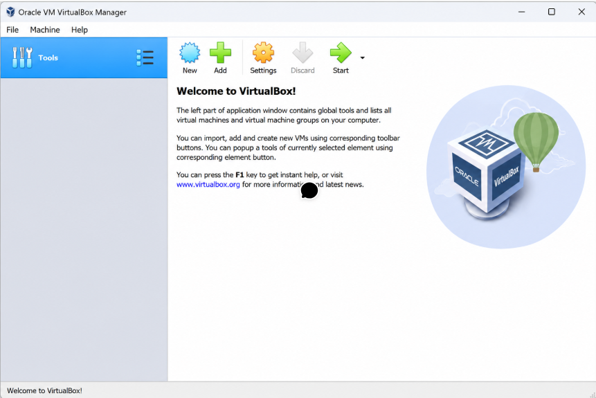
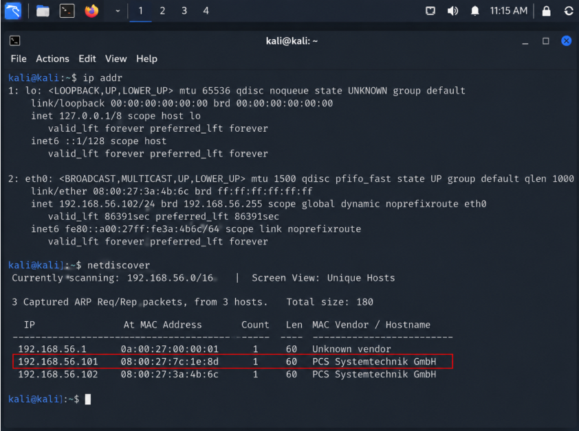
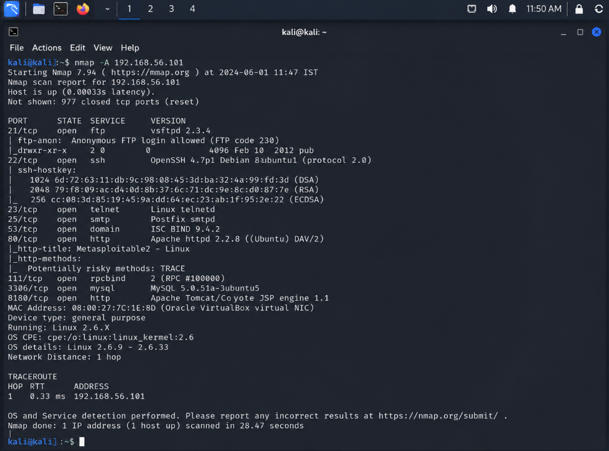
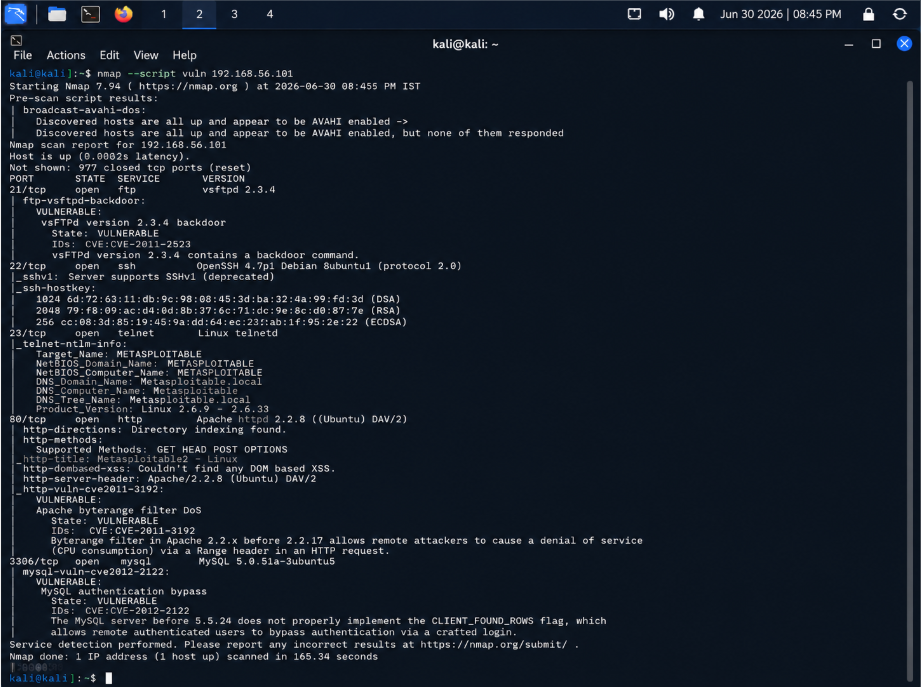
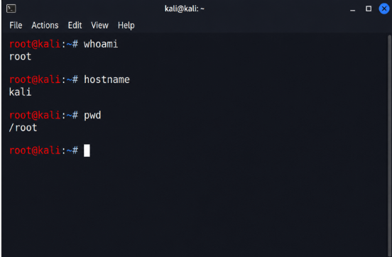

# Penetration Testing Simulation

## Objective

Perform a controlled penetration testing simulation in a safe virtual lab.

## Tools Used

- VirtualBox
- Kali Linux
- Metasploitable2
- Nmap
- Nikto
- Metasploit

## Methodology

1. Lab setup
2. Reconnaissance
3. Port scanning
4. Vulnerability assessment
5. Basic exploitation
6. Findings

## Findings

Open ports:
- FTP
- SSH
- HTTP
- MySQL

Identified Vulnerabilities:
- VSFTPD Backdoor
- Weak Services

# Screenshots

## 1. Lab Setup

---

## 2. IP Discovery

---

## 3. Nmap Scan

---

## 4. Vulnerability Scan

## 6. Post Exploitation

## Conclusion

This project demonstrated the penetration testing lifecycle in an isolated environment without targeting real systems.
